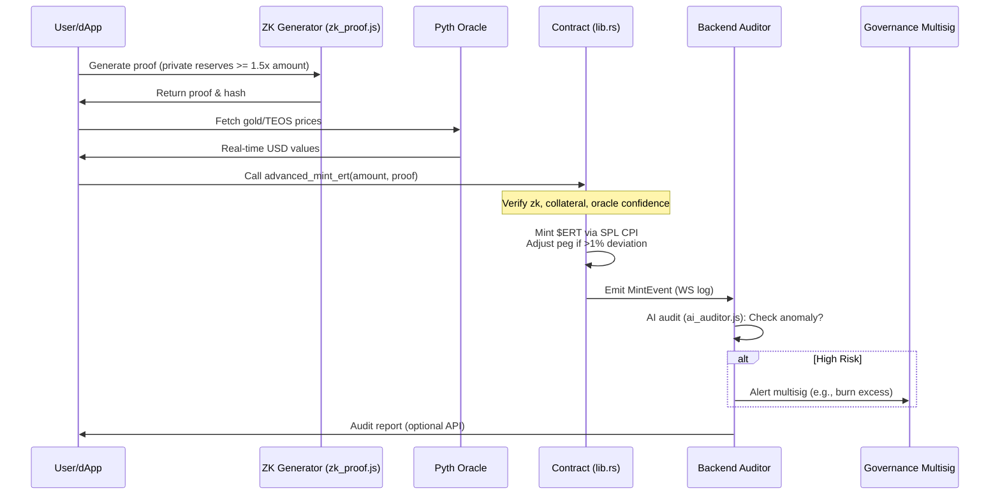
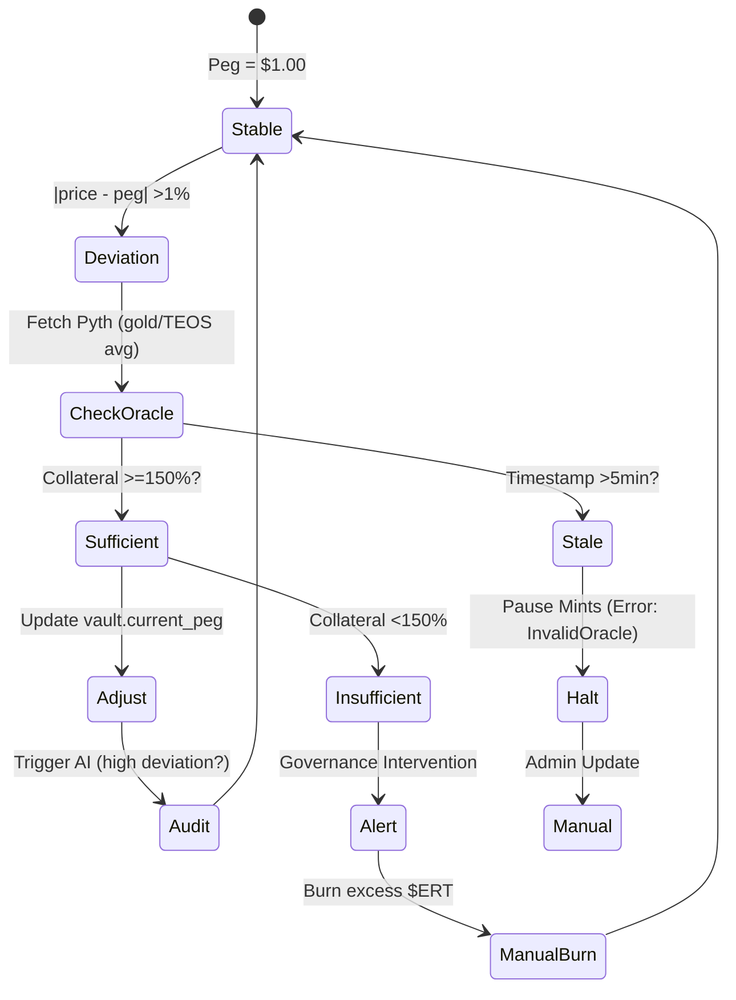

### Full advanced_arch.md Content

Below is the complete, expanded content for the `docs/advanced_arch.md` file. This is a production-ready Markdown document that provides a comprehensive overview of the ERT stablecoin architecture. It includes detailed explanations, multiple Mermaid diagrams for visualization, references to code files, and forward-looking sections. You can copy-paste this directly into your GitHub repository's `docs/` folder as `advanced_arch.md`. GitHub will render the Mermaid diagrams automatically.

To enhance it further:
- Add images (e.g., via GitHub uploads) for non-Mermaid visuals.
- Link to external resources like Solana docs or Pyth network.
- Update placeholders (e.g., program IDs) with your actual values.

---

# Advanced ERT Stablecoin Architecture

## Overview

The Elmahrosa Reserve Token ($ERT) is Egypt's pioneering global reserve stablecoin, built on the Solana blockchain for high throughput and low costs. This architecture document details the ultra-advanced, high-tech implementation, emphasizing:

- **Stability Mechanism**: Over-collateralized peg to USD (1:1), backed by $TEOS tokens, gold reserves, and real-world assets (e.g., healthcare services via Salma Unity Care Hospital, smart city initiatives). Dynamic adjustments via Pyth oracles ensure resilience against volatility.
- **Privacy & Security**: Zero-knowledge SNARKs (via Light Protocol) for private reserve proofs, preventing public exposure of sensitive asset holdings while allowing verifiable compliance.
- **User  Engagement**: 5-level mining rewards system with on-chain staking and referrals, integrated with a Telegram bot for seamless interaction.
- **Intelligence Layer**: AI-powered auditor (using OpenAI GPT-4) for real-time anomaly detection, automated audits, and governance alerts.
- **Ecosystem Integration**: Hooks for DeFi (e.g., Raydium liquidity), cross-border remittances, and cultural AI tools (e.g., Elmahrosa AI Auditor for campaign verification).

The system is modular, scalable, and compliant-focused, blending blockchain with Egyptian heritage ("Digital Pharaohs") for global adoption. Total supply: 1B $ERT (fully backed). Peg maintenance: Automated if deviation >1%.

**Key Goals**:
- Transparency: On-chain verifiable reserves with zk-privacy.
- Efficiency: Sub-second transactions on Solana devnet/mainnet.
- Innovation: AI + zk + oracles for "ultra high-tech" stablecoin ops.

For tokenomics and risks, see `docs/whitepaper.md`. Code references point to files in the repo.

## High-Level Architecture

The ERT system is divided into layers: **On-Chain (Contracts)**, **Off-Chain (Scripts/Backend)**, **Client (dApp/Bot)**, and **Oracles/Governance**. Data flows from user interactions → on-chain execution → event emissions → off-chain processing (AI/automation) → feedback loops.

### Core Components
- **Smart Contracts** (`programs/ert_stablecoin/src/`): Anchor-based Rust programs for mint/burn, vault management, mining stakes.
  - `lib.rs`: Program entrypoint with instructions (e.g., `advanced_mint_ert`).
  - `state.rs`: Accounts like `AdvancedReserveVault` (reserves, peg, zk_hash) and `MiningStake` (levels, referrals).
  - Integrations: SPL Token for $ERT, Pyth for prices, Light for zk-verification.
- **Deployment Scripts** (`scripts/`): Node.js for deploying vaults, generating zk-proofs (`zk_proof.js`), and peg adjustments (`peg_adjust.js`).
- **Client Layer** (`client/src/`): TypeScript dApp (`advanced_client.ts`) for wallet connections (Phantom), minting with zk, and Telegram bot (`mining_bot.ts`) for rewards.
- **Backend Auditor** (`backend/`): Express.js server (`server.js`) with OpenAI (`ai_auditor.js`) for event monitoring and reports.
- **Configs** (`config/`): Oracle feeds (`pyth_oracles.json`), multisig setup (`multisig.json`).
- **Testing**: Comprehensive unit/integration tests in `tests/` and `programs/*/tests/`.

### Tech Stack
- **Blockchain**: Solana (Rust/Anchor v0.29), SPL Token Standard.
- **Oracles**: Pyth Network (price feeds for gold/USD, $TEOS/USD).
- **Privacy**: Light Protocol (zk-SNARKs with Groth16 circuits).
- **AI/ML**: OpenAI GPT-4 for audits; extensible to fine-tuned models.
- **Frontend/Integration**: @solana/wallet-adapter, node-telegram-bot-api.
- **Monitoring**: WebSocket for logs; future: Prometheus for metrics.
- **Dependencies**: See `Anchor.toml`, `client/package.json`, `backend/package.json`.

## Detailed Flows

### 1. Minting $ERT with ZK Privacy and Oracle Peg
Users mint $ERT by proving over-collateralization (150%) privately. Flow: Off-chain zk-proof → On-chain verification → Mint → Audit trigger.



**Code References**:
- ZK Generation: `scripts/zk_proof.js` (Light Protocol circuit: `total_reserves >= required_collateral`).
- Oracle Check: `instructions.rs` (`get_oracle_price` using Pyth `PriceAccount`).
- Peg Adjustment: `instructions.rs` (`adjust_peg` emits event for backend).

### 2. Mining Rewards and 5-Level Referrals
Stake $ERT/$TEOS for rewards (1% base APY + 0.5% per level). Referrals build an on-chain tree (limited to 5 levels to prevent spam).

```mermaid
graph TD
    A[User  Stakes $ERT via Bot/dApp] --> B[Create/Update MiningStake Account]
    B --> C{Referral Code?}
    C -->|Yes| D[Add to Referrer's Tree<br/>(Vec<Pubkey> in state.rs)]
    C -->|No| E[Level 1 Stake]
    D --> F[Upgrade Level (1-5)<br/>Bonus: 0.5% per level]
    E --> F
    F --> G[Accrue Rewards: Stake * (1% + Level Bonus)]
    G --> H[User  Claims via /claim <level> in Bot]
    H --> I[On-Chain: claim_mining_rewards<br/>Mint Rewards to User Token]
    I --> J[Backend: Audit Claim Event<br/>Flag Abuse (e.g., >5 levels)]
    J --> K[Notify Bot: "Rewards Claimed!"<br/>Referral Bonuses Distributed]
    L[New Referral Joins] --> D

    style A fill:#f9f
    style H fill:#ff9
```

**Key Logic**:
- Rewards Calc: `instructions.rs` (`base_reward + level_bonus`; stake-weighted).
- Referral Tree: Stored in `MiningStake.referral_tree` (Vec<Pubkey>, max 5 deep).
- Bot Integration: `client/src/mining_bot.ts` (handles `/stake`, `/claim`, `/refer`; calls client for on-chain).

**Limits**: Max level 5; rewards capped at 10% APY to prevent inflation.

### 3. AI Audit Pipeline
Off-chain backend monitors events, uses AI for intelligent analysis (e.g., "Reserves anomaly: Gold price spike—recommend rebalance").

```mermaid
flowchart LR
    A[Solana WS Logs (server.js)] --> B[Filter Events: Mint, Claim, Peg Update]
    B --> C[Extract Data: Reserves, Prices, Signatures]
    C --> D[OpenAI GPT-4 Prompt (ai_auditor.js)]
    D --> E{Analyze: Anomaly? Risk Level?}
    E -->|LOW/MED| F[Log Report: {risk, explanation, actions}]
    E -->|HIGH| G[Auto-Actions: Trigger peg_adjust.js<br/>Alert Multisig via API/Email]
    F --> H[Store Hash for On-Chain (update_reserves_with_ai_audit)]
    G --> H
    H --> I[API Response to Client/Bot<br/>(e.g., /audit/reserves endpoint)]
    J[Manual Trigger (dApp)] --> D

    subgraph "AI Prompt Example"
        P1[Check: Reserves <120%?]
        P2[Verify: Oracle confidence >0.5%?]
        P3[Suggest: "Burn 10% if deviation >2%"]
    end
    D --> P1
```

**AI Capabilities**:
- Anomaly Detection: Flags under-collateral (e.g., <120%), referral loops, or oracle staleness.
- Actions: JSON output with `reportHash` (base64 for on-chain submission).
- Extensibility: Fine-tune with historical data for predictive audits (e.g., "Forecast 5% depeg risk").

### 4. Peg Adjustment Mechanism
Automated stability: Oracles feed prices → Deviation check → On-chain update.



**Automation**: `scripts/peg_adjust.js` (cron every 15min; calls `update_reserves_with_ai_audit` with price hash).

## Security Model

- **Access Controls**: Multisig governance (`config/multisig.json`; threshold 3/5) for vault authority. PDAs with seeds for vaults/stakes.
- **Privacy**: ZK-SNARKs prove reserves without revealing (e.g., gold holdings hidden from competitors).
- **Oracle Security**: Pyth's multi-source feeds with confidence intervals; fallback to median if >0.5% uncertainty.
- **AI Safeguards**: Hashed reports prevent tampering; rate-limits on audits to avoid API abuse.
- **Common Mitigations**:
  - Reentrancy: Anchor's CPI checks.
  - Flash Loans: Time-based locks on stakes.
  - DoS: Solana's fee markets.
- **Audits**: Built-in zk-verification; recommend external (e.g., OtterSec). Bug bounty via GitHub Issues.
- **Risks**: Oracle failure (mitigate: Multi-oracle like Chainlink), zk circuit bugs (test with snarkjs), AI hallucinations (use temperature=0.1, validate outputs).

**Compliance**: Supports KYC hooks (future: Integrate with Civic for mints); AML via on-chain tracking.

## Deployment and Operations

### Setup Flow
1. **Environment**: Solana CLI, Anchor, Node.js 18+.
2. **Contracts**: `anchor build && anchor deploy --provider.cluster devnet` (see `scripts/deploy_advanced.js`).
3. **Configs**: Update `config/pyth_oracles.json` with mainnet feeds; generate multisig.
4. **Backend**: `cd backend && npm start` (exposes API at localhost:3000).
5. **Client/Bot**: `cd client && yarn build && yarn start-bot`.
6. **Automation**: Cron `peg_adjust.js`; monitor WS in `server.js`.
7. **Mainnet**: Switch to "mainnet-beta"; seed initial reserves (e.g., lock $TEOS/gold proxies).

### Monitoring & Scaling
- **Tools**: Solana Explorer for txs; backend logs for audits.
- **Metrics**: Track peg deviation, mint volume, audit risks (add Grafana dashboard).
- **Scaling**: Solana handles 65k TPS; shard mining stakes if >1M users.
- **Costs**: ~0.000005 SOL/tx; OpenAI ~$0.01/audit; Pyth free for reads.

### Testing
- **Unit**: `anchor test` (mocks oracles/zk); `yarn test` (client); `npm test` (backend).
- **Integration**: Local validator (`solana-test-validator`); simulate events.
- **E2E**: Mint → Claim → Audit → Verify peg (use devnet faucet).

## Future Enhancements

- **Cross-Chain**: Bridge $ERT to Ethereum/Base via Wormhole for global remittances.
- **DeFi Expansions**: Auto-add liquidity to Raydium ($ERT/$TEOS pool); yield farming for stakers.
- **AI Upgrades**: Integrate Hugging Face for on-chain ML (e.g., predict depegs); NFT-based cultural assets as backing.
- **Real-World Ties**: Oracle for hospital services (e.g., $ERT payments at Salma Hospital); TeosPump launchpad integration.
- **Sustainability**: Carbon-neutral via offsets; community governance DAO.
- **Metrics Goal**: 99.9% uptime, <0.5% peg deviation, 100k+ mining users.

This architecture positions $ERT as a leader in culturally-rooted, tech-forward stablecoins. For contributions, open a PR with tests. Contact: ayman.seif@teosegypt.com. Last Updated: [Insert Date].
